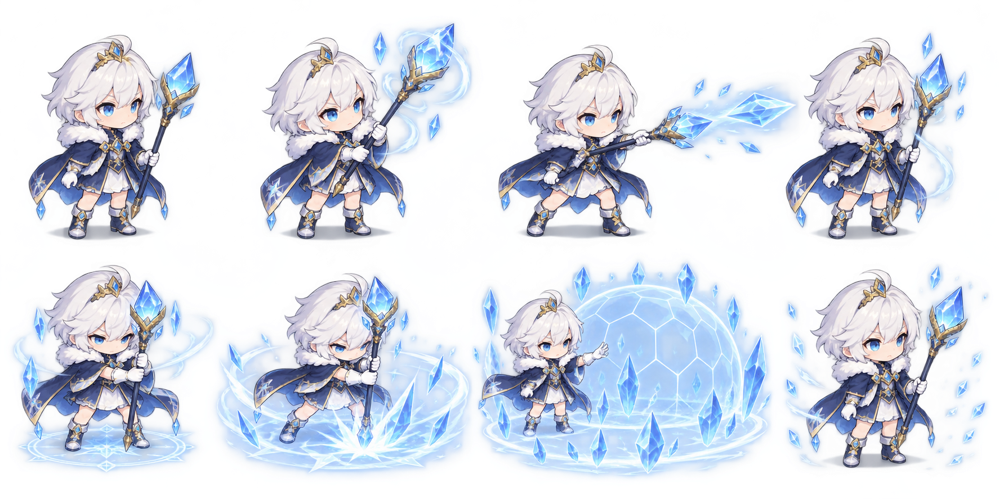
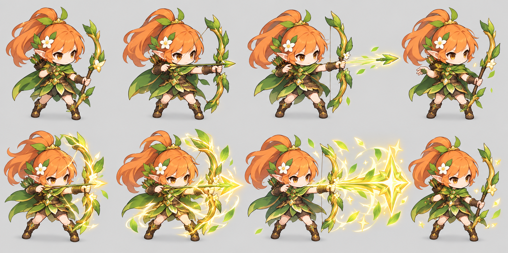
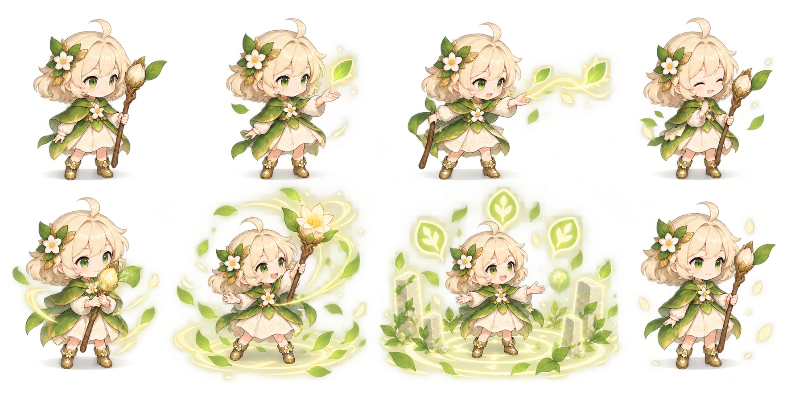
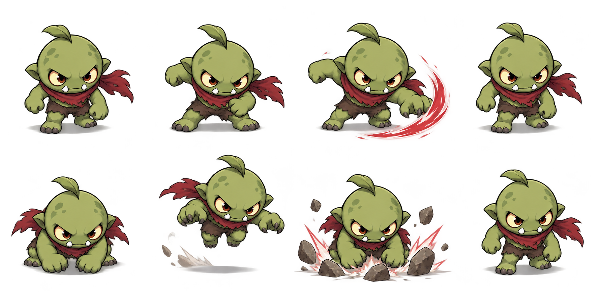
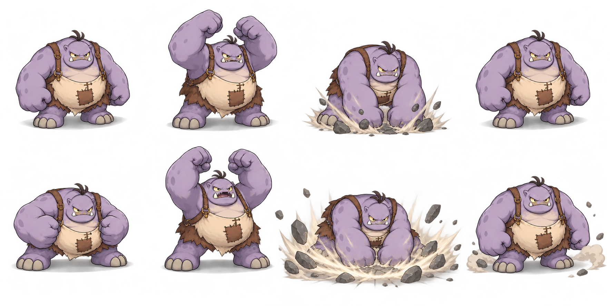
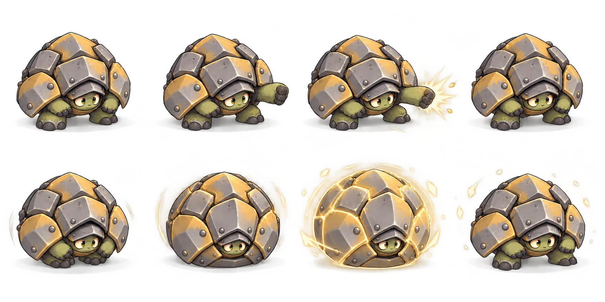
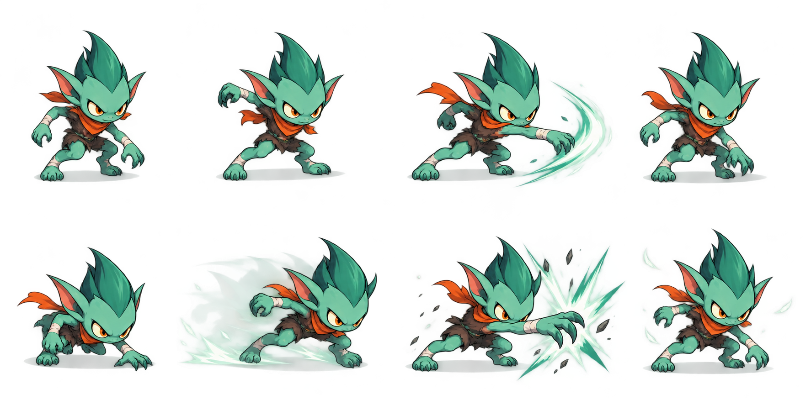

# 旧角色动漫统一改版 v2

日期：2026-09-27。范围：三名守卫 + 四种普通怪物，七张动作分镜，共56个关键姿态。状态：概念美术待确认，未制作连续帧，未接入游戏。

## 怎么看

每张从左到右：上排“待机 / 普攻蓄力 / 普攻释放 / 收势”；下排“大招预备 / 释放 / 效果峰值 / 消散”。守卫大招对应已有技能，怪物特殊技能仅供未来精英变体设计，不改变当前十波难度。

## 三位守卫

### 冰霜法师

[中文提示词](../../assets/design/anime-v2/defenders/mage/prompt-v2.md)

### 精灵弓箭手

[中文提示词](../../assets/design/anime-v2/defenders/archer/prompt-v2.md)

### 花叶祝福者

[中文提示词](../../assets/design/anime-v2/defenders/healer/prompt-v2.md)

## 四种怪物

### 小怪兽

[中文提示词](../../assets/design/anime-v2/monsters/basic/prompt-v2.md)

### 肉盾怪兽

[中文提示词](../../assets/design/anime-v2/monsters/tank/prompt-v2.md)

### 甲壳怪兽

[中文提示词](../../assets/design/anime-v2/monsters/armored/prompt-v2.md)

### 敏捷怪兽

[中文提示词](../../assets/design/anime-v2/monsters/agile/prompt-v2.md)

## 素材检查结果

- 实际文件均1774×887，和提示词请求2048×1024不同；保留原图，未强制拉伸。
- 弓箭手为不透明实底，其余六张带Alpha；带Alpha不等于干净精灵，半透明阴影、光晕和边缘仍需检查。
- 已目视检查每张八个姿态与主要身份特征；人物画面尺寸、朝向、脚底并未达到逐帧动画标准。
- 冰法和祝福者的效果峰值分镜将人物缩小以展示技能范围，不能直接切图播放，否则会重现用户反馈的施法缩小问题。
- 部分光效跨格或靠近画边，人物与效果未分层；弓箭手的大招峰值应最终放在目标落点，不是永远贴着弓口。
- 怪物仍保持非人形轮廓与体型差异，不要求与守卫拥有相同头身比；统一的是上色、外轮廓与光影语言。
- 本轮没有重做行走循环、I/II级独立素材、独立Boss美术、角色封面或3D模型。Boss目前仍复用旧肉盾立绘，不能因这里肉盾改版而称Boss已更新。

## 后续制作

动作时长、命中点、技能层拆分与接入规则见 [动画设计规格](anime-v2-animation-prd.md)。先批准造型，再生成独立人物动作与特效，做切图、透明边缘和脚底校准，最后接入并录制真机录像。保留所有旧版运行时资源。

